# GitHub Actions CI/CD

This repository includes comprehensive GitHub Actions workflows for automated testing, building, and deployment.

## 🚀 Workflows

### 1. CI/CD Pipeline (`ci-cd.yml`)

**Triggers:** Push to `main`/`preview`, Pull Requests

**Jobs:**

- **Lint & Type Check**: ESLint, TypeScript, Prettier validation
- **Build & Test**: Production build verification
- **Security Audit**: Dependency vulnerability scanning
- **Performance Check**: Lighthouse CI on PRs
- **Deploy Preview**: Auto-deploy to Vercel preview
- **Deploy Production**: Auto-deploy to Vercel production

### 2. Pull Request Automation (`auto-deploy.yml`)

**Triggers:** Push to `preview` branch, Manual dispatch

**Features:**

- **Auto-Create PR**: Automatically creates PR from preview → main
- **Build Verification**: Runs build check before PR creation
- **Smart Updates**: Updates existing PR instead of creating duplicates
- **Rich PR Description**: Includes build status and deployment info

**Process:**

1. Push to `preview` branch
2. Workflow runs build verification
3. Creates/updates PR with detailed description
4. Ready for review and approval

### 3. Auto-Merge Approved PRs (`auto-merge.yml`)

**Triggers:** Pull Request events (opened, synchronize, reopened)

**Features:**

- **Auto-Merge**: Automatically merges approved PRs from preview branch
- **Build Verification**: Final build check before merge
- **Clean Commits**: Uses squash merge for clean history
- **Deployment Trigger**: Automatically triggers Vercel deployment

**Process:**

1. PR is created from preview branch
2. Review and approve the PR
3. Workflow automatically merges to main
4. Vercel deploys the changes

### 4. Security Scan (`security-scan.yml`)

**Triggers:** Push, PR, Daily schedule

**Features:**

- CodeQL analysis for security vulnerabilities
- Trivy filesystem scanning
- Dependency review on PRs
- Daily security monitoring

### 5. Performance Monitoring (`performance-monitor.yml`)

**Triggers:** Push, Daily schedule

**Features:**

- Lighthouse CI performance testing
- Core Web Vitals monitoring
- PR comments with performance scores
- Daily performance regression detection

### 6. Dependency Updates (`dependency-update.yml`)

**Triggers:** Weekly schedule, Manual

**Features:**

- Automatic dependency updates
- Security vulnerability fixes
- Automated PR creation
- Test verification after updates

## 🔄 Complete Workflow Guide

### Workflow Diagram

```mermaid
graph TD
    A[GitHub Issue Created] --> B[Create Feature Branch]
    B --> C[Develop & Commit]
    C --> D[Push Feature Branch]
    D --> E[Create PR: feature → preview]
    E --> F[Review & Test on Preview]
    F --> G[Approve & Merge to Preview]
    G --> H[Auto-Create PR: preview → main]
    H --> I[Review Preview Changes]
    I --> J[Approve Production PR]
    J --> K[Auto-Merge to Main]
    K --> L[Auto-Deploy to Production]

    style A fill:#e1f5fe
    style B fill:#f3e5f5
    style C fill:#f3e5f5
    style D fill:#f3e5f5
    style E fill:#fff3e0
    style F fill:#fff3e0
    style G fill:#e8f5e8
    style H fill:#fff3e0
    style I fill:#fff3e0
    style J fill:#e8f5e8
    style K fill:#e8f5e8
    style L fill:#e8f5e8
```



### Development Workflow

1. **Create Feature Branch** (linked to GitHub issue):

   ```bash
   git checkout -b feature/issue-123-add-new-feature
   # Make your changes
   git add .
   git commit -m "Add new feature (closes #123)"
   git push origin feature/issue-123-add-new-feature
   ```

2. **Create PR to Preview**:
   - Create PR from feature branch → preview branch
   - Link to GitHub issue in PR description
   - Review changes and test on preview deployment

3. **Merge to Preview**:
   - Approved PRs merge to preview branch
   - Preview branch gets deployed to Vercel preview URL

4. **Automatic Production PR**:
   - GitHub Actions creates PR from preview → main
   - Build verification runs automatically
   - PR includes detailed description and status

5. **Review & Deploy**:
   - Review the preview changes and approve the PR
   - Approved PR is automatically merged to main
   - Vercel automatically deploys to production

### Branch Strategy

- **`main`**: Production branch, auto-deploys to production
- **`preview`**: Integration branch, auto-creates PRs to main
- **`feature/*`**: Development branches, PR to preview
- **Issue Linking**: Feature branches should reference GitHub issues

### GitHub Issue Integration

**Best Practices:**

1. **Create GitHub Issue First**:
   - Describe the feature/bug fix
   - Add labels (enhancement, bug, etc.)
   - Assign to developer

2. **Branch Naming Convention**:

   ```bash
   feature/issue-123-add-new-feature
   bugfix/issue-456-fix-login-error
   hotfix/issue-789-critical-security-fix
   ```

3. **PR Description Template**:

   ```markdown
   ## Description

   Brief description of changes

   ## Related Issue

   Closes #123

   ## Changes Made

   - List of changes
   - Screenshots if applicable

   ## Testing

   - [ ] Tested locally
   - [ ] Tested on preview deployment
   - [ ] No breaking changes
   ```

4. **Commit Message Format**:
   ```bash
   git commit -m "Add new feature (closes #123)"
   git commit -m "Fix login error (fixes #456)"
   ```

### Workflow Benefits

✅ **Safe Deployments**: Review process prevents bad code from reaching production  
✅ **Automated Testing**: Build verification before every merge  
✅ **Clean History**: Squash merges maintain clean commit history  
✅ **Fast Feedback**: Immediate build status and PR creation  
✅ **Zero Downtime**: Automated deployment with Vercel  
✅ **Issue Tracking**: Clear connection between code and requirements  
✅ **Team Collaboration**: Multiple developers can work on different features

## 🔧 Setup Requirements

### Required Secrets

Add these secrets to your GitHub repository:

```bash
# Vercel Deployment
VERCEL_TOKEN=your_vercel_token
VERCEL_ORG_ID=your_org_id
VERCEL_PROJECT_ID=your_project_id
```

### Getting Vercel Credentials

1. Go to [Vercel Dashboard](https://vercel.com/dashboard)
2. Navigate to your project settings
3. Go to "General" tab
4. Copy the Project ID
5. Go to [Account Settings](https://vercel.com/account/tokens)
6. Create a new token
7. Get your Team ID from the URL or API

## 📊 Performance Thresholds

The workflows enforce these performance standards:

| Metric         | Threshold | Action  |
| -------------- | --------- | ------- |
| Performance    | ≥ 80%     | Warning |
| Accessibility  | ≥ 90%     | Error   |
| Best Practices | ≥ 80%     | Warning |
| SEO            | ≥ 80%     | Warning |
| LCP            | ≤ 4s      | Warning |
| FID            | ≤ 300ms   | Warning |
| CLS            | ≤ 0.1     | Warning |

## 🛠️ Local Development

To run the same checks locally:

```bash
# Install dependencies
pnpm install

# Run linting
pnpm lint

# Type check
pnpm type-check

# Check formatting
pnpm format:check

# Build
pnpm build

# Security audit
pnpm audit

# Start for testing
pnpm start
```

## 📈 Monitoring

- **Performance**: Check Lighthouse CI results in workflow logs
- **Security**: Monitor security alerts in GitHub Security tab
- **Dependencies**: Review automated PRs for updates
- **Deployments**: Check Vercel dashboard for deployment status

## 🔄 Workflow Status

All workflows include status badges that you can add to your README:

```markdown


```

## 🚨 Troubleshooting

### Common Issues

1. **Build Failures**: Check Node.js version compatibility
2. **Security Alerts**: Review and update vulnerable dependencies
3. **Performance Regression**: Check Lighthouse CI results
4. **Deployment Issues**: Verify Vercel credentials and project settings

### Getting Help

- Check workflow logs in the Actions tab
- Review GitHub's [Actions documentation](https://docs.github.com/en/actions)
- Check [Vercel's deployment docs](https://vercel.com/docs)
